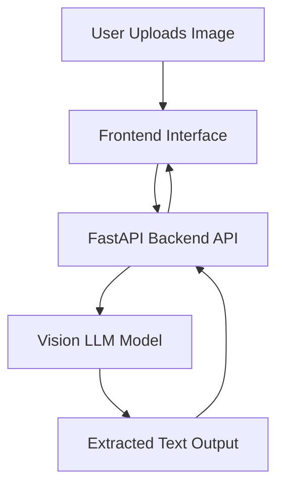

# 🧠 Handwritten OCR using Vision Language Model

An AI-powered handwritten text recognition system built using a Vision Language Model (VLM).

This project exposes a FastAPI-based REST API that accepts handwritten images and returns structured JSON output.

---

## 🚀 Features

* Upload handwritten image
* Vision LLM-based text extraction
* FastAPI backend
* Dockerized deployment
* Structured JSON response

---

## 🗂️ Project Structure

<pre class="overflow-visible! px-0!" data-start="1246" data-end="1470"><div class="w-full my-4"><div class=""><div class="relative"><div class="h-full min-h-0 min-w-0"><div class="h-full min-h-0 min-w-0"><div class="border corner-superellipse/1.1 border-token-border-light bg-token-bg-elevated-secondary rounded-3xl"><div class="pointer-events-none absolute inset-x-4 top-12 bottom-4"><div class="pointer-events-none sticky z-40 shrink-0 z-1!"><div class="sticky bg-token-border-light"></div></div></div><div class="pointer-events-none absolute inset-x-px top-6 bottom-6"><div class="sticky z-1!"><div class="bg-token-bg-elevated-secondary sticky"></div></div></div><div class="corner-superellipse/1.1 rounded-3xl bg-token-bg-elevated-secondary"><div class="relative z-0 flex max-w-full"><div id="code-block-viewer" dir="ltr" class="q9tKkq_viewer cm-editor z-10 light:cm-light dark:cm-light flex h-full w-full flex-col items-stretch ͼk ͼy"><div class="cm-scroller"><div class="cm-content q9tKkq_readonly"><span>handwritten-ocr-vision-llm/</span><br/><span>│</span><br/><span>├── ocr-backend/</span><br/><span>│   ├── main.py</span><br/><span>│   ├── Dockerfile</span><br/><span>│   ├── docker-compose.yml</span><br/><span>│   └── models/ (excluded from Git)</span><br/><span>│</span><br/><span>├── ocr-frontend/</span><br/><span>│   └── app.py</span><br/><span>│</span><br/><span>├── requirements.txt</span><br/><span>└── README.md</span></div></div></div></div></div></div></div></div><div class=""><div class=""></div></div></div></div></div></pre>

---

## 🏛️ System Architecture



## 📦 Installation

### 1️⃣ Clone the repository

```bash
git clone https://github.com/your-username/your-repo-name.git
cd your-repo-name
```

### 2️⃣ Create virtual environment

<pre class="overflow-visible! px-0!" data-start="1868" data-end="1930"><div class="w-full my-4"><div class=""><div class="relative"><div class="h-full min-h-0 min-w-0"><div class="h-full min-h-0 min-w-0"><div class="border corner-superellipse/1.1 border-token-border-light bg-token-bg-elevated-secondary rounded-3xl"><div class="pointer-events-none absolute inset-x-4 top-12 bottom-4"><div class="pointer-events-none sticky z-40 shrink-0 z-1!"><div class="sticky bg-token-border-light"></div></div></div><div class="pointer-events-none absolute inset-x-px top-6 bottom-6"><div class="sticky z-1!"><div class="bg-token-bg-elevated-secondary sticky"></div></div></div><div class="corner-superellipse/1.1 rounded-3xl bg-token-bg-elevated-secondary"><div class="relative z-0 flex max-w-full"><div id="code-block-viewer" dir="ltr" class="q9tKkq_viewer cm-editor z-10 light:cm-light dark:cm-light flex h-full w-full flex-col items-stretch ͼk ͼy"><div class="cm-scroller"><div class="cm-content q9tKkq_readonly"><span>python </span><span class="ͼu">-m</span><span> venv .venv</span><br/><span class="ͼs">source</span><span> .venv/Scripts/activate</span></div></div></div></div></div></div></div></div></div></div></div></pre>

### 3️⃣ Install dependencies

<pre class="overflow-visible! px-0!" data-start="1962" data-end="2005"><div class="w-full my-4"><div class=""><div class="relative"><div class="h-full min-h-0 min-w-0"><div class="h-full min-h-0 min-w-0"><div class="border corner-superellipse/1.1 border-token-border-light bg-token-bg-elevated-secondary rounded-3xl"><div class="pointer-events-none absolute inset-x-4 top-12 bottom-4"><div class="pointer-events-none sticky z-40 shrink-0 z-1!"><div class="sticky bg-token-border-light"></div></div></div><div class="pointer-events-none absolute inset-x-px top-6 bottom-6"><div class="sticky z-1!"><div class="bg-token-bg-elevated-secondary sticky"></div></div></div><div class="corner-superellipse/1.1 rounded-3xl bg-token-bg-elevated-secondary"><div class="relative z-0 flex max-w-full"><div id="code-block-viewer" dir="ltr" class="q9tKkq_viewer cm-editor z-10 light:cm-light dark:cm-light flex h-full w-full flex-col items-stretch ͼk ͼy"><div class="cm-scroller"><div class="cm-content q9tKkq_readonly"><span>pip install </span><span class="ͼu">-r</span><span> requirements.txt</span></div></div></div></div></div></div></div></div><div class=""><div class=""></div></div></div></div></div></pre>

### 4️⃣ Run the server

<pre class="overflow-visible! px-0!" data-start="2031" data-end="2068"><div class="w-full my-4"><div class=""><div class="relative"><div class="h-full min-h-0 min-w-0"><div class="h-full min-h-0 min-w-0"><div class="border corner-superellipse/1.1 border-token-border-light bg-token-bg-elevated-secondary rounded-3xl"><div class="pointer-events-none absolute inset-x-4 top-12 bottom-4"><div class="pointer-events-none sticky z-40 shrink-0 z-1!"><div class="sticky bg-token-border-light"></div></div></div><div class="pointer-events-none absolute inset-x-px top-6 bottom-6"><div class="sticky z-1!"><div class="bg-token-bg-elevated-secondary sticky"></div></div></div><div class="corner-superellipse/1.1 rounded-3xl bg-token-bg-elevated-secondary"><div class="relative z-0 flex max-w-full"><div id="code-block-viewer" dir="ltr" class="q9tKkq_viewer cm-editor z-10 light:cm-light dark:cm-light flex h-full w-full flex-col items-stretch ͼk ͼy"><div class="cm-scroller"><div class="cm-content q9tKkq_readonly"><span>uvicorn main:app </span><span class="ͼu">--reload</span></div></div></div></div></div></div></div></div><div class=""><div class=""></div></div></div></div></div></pre>

Server runs at:

<pre class="overflow-visible! px-0!" data-start="2087" data-end="2116"><div class="w-full my-4"><div class=""><div class="relative"><div class="h-full min-h-0 min-w-0"><div class="h-full min-h-0 min-w-0"><div class="border corner-superellipse/1.1 border-token-border-light bg-token-bg-elevated-secondary rounded-3xl"><div class="pointer-events-none absolute inset-x-4 top-12 bottom-4"><div class="pointer-events-none sticky z-40 shrink-0 z-1!"><div class="sticky bg-token-border-light"></div></div></div><div class="pointer-events-none absolute inset-x-px top-6 bottom-6"><div class="sticky z-1!"><div class="bg-token-bg-elevated-secondary sticky"></div></div></div><div class="corner-superellipse/1.1 rounded-3xl bg-token-bg-elevated-secondary"><div class="relative z-0 flex max-w-full"><div id="code-block-viewer" dir="ltr" class="q9tKkq_viewer cm-editor z-10 light:cm-light dark:cm-light flex h-full w-full flex-col items-stretch ͼk ͼy"><div class="cm-scroller"><div class="cm-content q9tKkq_readonly"><span>http://127.0.0.1:8000</span></div></div></div></div></div></div></div></div><div class=""><div class=""></div></div></div></div></div></pre>

## 📌 API Endpoint

**POST** `/upload`

Returns:

<pre class="overflow-visible! px-0!" data-start="1993" data-end="2058"><div class="w-full my-4"><div class=""><div class="relative"><div class="h-full min-h-0 min-w-0"><div class="h-full min-h-0 min-w-0"><div class="border corner-superellipse/1.1 border-token-border-light bg-token-bg-elevated-secondary rounded-3xl"><div class="pointer-events-none absolute inset-x-4 top-12 bottom-4"><div class="pointer-events-none sticky z-40 shrink-0 z-1!"><div class="sticky bg-token-border-light"></div></div></div><div class="pointer-events-none absolute inset-x-px top-6 bottom-6"><div class="sticky z-1!"><div class="bg-token-bg-elevated-secondary sticky"></div></div></div><div class="corner-superellipse/1.1 rounded-3xl bg-token-bg-elevated-secondary"><div class="relative z-0 flex max-w-full"><div id="code-block-viewer" dir="ltr" class="q9tKkq_viewer cm-editor z-10 light:cm-light dark:cm-light flex h-full w-full flex-col items-stretch ͼk ͼy"><div class="cm-scroller"><div class="cm-content q9tKkq_readonly"><span>{</span><br/><span>  "extracted_text": </span><span class="ͼr">"Recognized handwritten text"</span><br/><span>}</span></div></div></div></div></div></div></div></div><div class=""><div class=""></div></div></div></div></div></pre>

---

## 👨‍💻 Author

Lalith Chandran

M.Sc Computer Science
