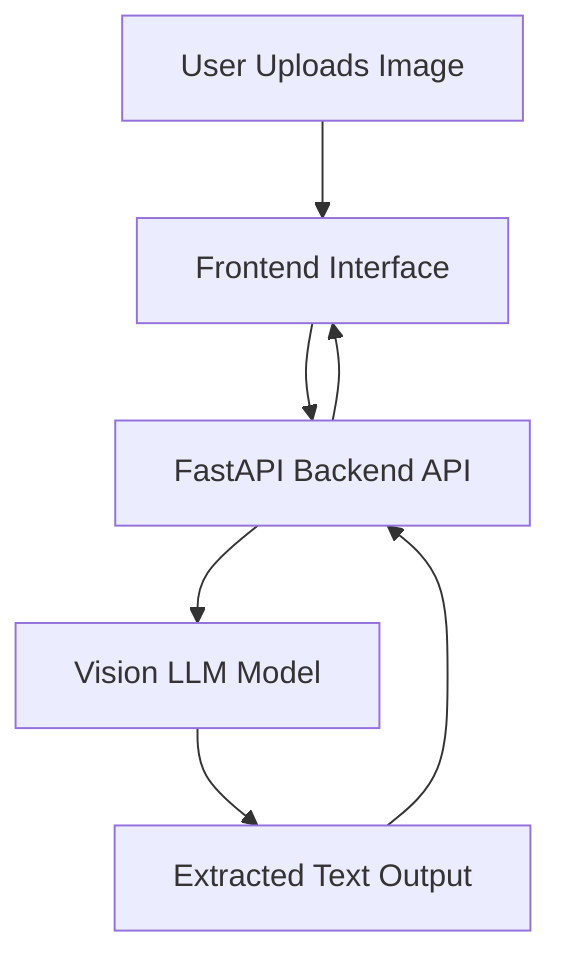

# 🧠 Handwritten OCR using Vision LLM


An AI-powered OCR system that extracts handwritten text from images using a Vision Large Language Model (LLM).

This project demonstrates:

- Backend API development using FastAPI
- Integration with Vision LLM models
- Image processing using Pillow
- REST API design and deployment practices

## Features

- Upload handwritten image
- Extract text using AI model
- Returns structured JSON response
- Built using FastAPI

## 🗂️ Project Structure

llm_ocr/

│

├── ocr-backend/

│   ├── main.py                 # FastAPI application entry point

│   ├── Dockerfile              # Backend container configuration

│   ├── docker-compose.yml      # Multi-container orchestration

│   ├── models/                 # LLM model weights (excluded from Git)

│   └── README.md               # Backend-specific documentation

│

├── ocr-frontend/

│   └── app.py                  # Frontend interface for uploading images

│

├── requirements.txt            # Python dependencies

├── .gitignore                  # Git ignore rules

└── README.md                   # Project documentation

### 📌 Structure Highlights

- Backend and frontend are modularized.
- Model files are excluded from version control.
- Docker setup enables portable deployment.
- Clean separation of inference logic and API layer.

### 🔎 Flow Explanation

## 🏛️ System Architecture



## 🛠 Tech Stack

### 🔎 Flow Explanation

1. User uploads handwritten image.
2. Frontend sends image via HTTP POST request.
3. FastAPI processes and forwards to Vision LLM.
4. Model performs OCR-style inference.
5. Structured JSON response returned to client.

- Python
- FastAPI
- OpenAI / LLaMA.cpp
- Pillow
- Uvicorn

## 📥 Model Setup

Due to large file size, model weights are not included in this repository.

Download the required `.gguf` models separately and place them inside:

ocr-backend/models/

## 📦 Installation

### 1️⃣ Clone the repository

```bash
git clone https://github.com/your-username/your-repo-name.git
cd your-repo-name
```

### 2️⃣ Create virtual environment

<pre class="overflow-visible! px-0!" data-start="1868" data-end="1930"><div class="w-full my-4"><div class=""><div class="relative"><div class="h-full min-h-0 min-w-0"><div class="h-full min-h-0 min-w-0"><div class="border corner-superellipse/1.1 border-token-border-light bg-token-bg-elevated-secondary rounded-3xl"><div class="pointer-events-none absolute inset-x-4 top-12 bottom-4"><div class="pointer-events-none sticky z-40 shrink-0 z-1!"><div class="sticky bg-token-border-light"></div></div></div><div class="pointer-events-none absolute inset-x-px top-6 bottom-6"><div class="sticky z-1!"><div class="bg-token-bg-elevated-secondary sticky"></div></div></div><div class="corner-superellipse/1.1 rounded-3xl bg-token-bg-elevated-secondary"><div class="relative z-0 flex max-w-full"><div id="code-block-viewer" dir="ltr" class="q9tKkq_viewer cm-editor z-10 light:cm-light dark:cm-light flex h-full w-full flex-col items-stretch ͼk ͼy"><div class="cm-scroller"><div class="cm-content q9tKkq_readonly"><span>python </span><span class="ͼu">-m</span><span> venv .venv</span><br/><span class="ͼs">source</span><span> .venv/Scripts/activate</span></div></div></div></div></div></div></div></div></div></div></div></pre>

### 3️⃣ Install dependencies

<pre class="overflow-visible! px-0!" data-start="1962" data-end="2005"><div class="w-full my-4"><div class=""><div class="relative"><div class="h-full min-h-0 min-w-0"><div class="h-full min-h-0 min-w-0"><div class="border corner-superellipse/1.1 border-token-border-light bg-token-bg-elevated-secondary rounded-3xl"><div class="pointer-events-none absolute inset-x-4 top-12 bottom-4"><div class="pointer-events-none sticky z-40 shrink-0 z-1!"><div class="sticky bg-token-border-light"></div></div></div><div class="pointer-events-none absolute inset-x-px top-6 bottom-6"><div class="sticky z-1!"><div class="bg-token-bg-elevated-secondary sticky"></div></div></div><div class="corner-superellipse/1.1 rounded-3xl bg-token-bg-elevated-secondary"><div class="relative z-0 flex max-w-full"><div id="code-block-viewer" dir="ltr" class="q9tKkq_viewer cm-editor z-10 light:cm-light dark:cm-light flex h-full w-full flex-col items-stretch ͼk ͼy"><div class="cm-scroller"><div class="cm-content q9tKkq_readonly"><span>pip install </span><span class="ͼu">-r</span><span> requirements.txt</span></div></div></div></div></div></div></div></div><div class=""><div class=""></div></div></div></div></div></pre>

### 4️⃣ Run the server

<pre class="overflow-visible! px-0!" data-start="2031" data-end="2068"><div class="w-full my-4"><div class=""><div class="relative"><div class="h-full min-h-0 min-w-0"><div class="h-full min-h-0 min-w-0"><div class="border corner-superellipse/1.1 border-token-border-light bg-token-bg-elevated-secondary rounded-3xl"><div class="pointer-events-none absolute inset-x-4 top-12 bottom-4"><div class="pointer-events-none sticky z-40 shrink-0 z-1!"><div class="sticky bg-token-border-light"></div></div></div><div class="pointer-events-none absolute inset-x-px top-6 bottom-6"><div class="sticky z-1!"><div class="bg-token-bg-elevated-secondary sticky"></div></div></div><div class="corner-superellipse/1.1 rounded-3xl bg-token-bg-elevated-secondary"><div class="relative z-0 flex max-w-full"><div id="code-block-viewer" dir="ltr" class="q9tKkq_viewer cm-editor z-10 light:cm-light dark:cm-light flex h-full w-full flex-col items-stretch ͼk ͼy"><div class="cm-scroller"><div class="cm-content q9tKkq_readonly"><span>uvicorn main:app </span><span class="ͼu">--reload</span></div></div></div></div></div></div></div></div><div class=""><div class=""></div></div></div></div></div></pre>

Server runs at:

<pre class="overflow-visible! px-0!" data-start="2087" data-end="2116"><div class="w-full my-4"><div class=""><div class="relative"><div class="h-full min-h-0 min-w-0"><div class="h-full min-h-0 min-w-0"><div class="border corner-superellipse/1.1 border-token-border-light bg-token-bg-elevated-secondary rounded-3xl"><div class="pointer-events-none absolute inset-x-4 top-12 bottom-4"><div class="pointer-events-none sticky z-40 shrink-0 z-1!"><div class="sticky bg-token-border-light"></div></div></div><div class="pointer-events-none absolute inset-x-px top-6 bottom-6"><div class="sticky z-1!"><div class="bg-token-bg-elevated-secondary sticky"></div></div></div><div class="corner-superellipse/1.1 rounded-3xl bg-token-bg-elevated-secondary"><div class="relative z-0 flex max-w-full"><div id="code-block-viewer" dir="ltr" class="q9tKkq_viewer cm-editor z-10 light:cm-light dark:cm-light flex h-full w-full flex-col items-stretch ͼk ͼy"><div class="cm-scroller"><div class="cm-content q9tKkq_readonly"><span>http://127.0.0.1:8000</span></div></div></div></div></div></div></div></div><div class=""><div class=""></div></div></div></div></div></pre>

## 📌 API Endpoint

### POST `/upload`

Upload an image and get extracted handwritten text.

## 👨‍💻 Author

Lalith Chandran

<pre class="overflow-visible! px-0!" data-start="2244" data-end="2405"><div class="w-full my-4"><div class=""><div class="relative"><div class="h-full min-h-0 min-w-0"><div class="h-full min-h-0 min-w-0"><div class="border corner-superellipse/1.1 border-token-border-light bg-token-bg-elevated-secondary rounded-3xl"><div class="pointer-events-none absolute inset-x-4 top-12 bottom-4"><div class="pointer-events-none sticky z-40 shrink-0 z-1!"><div class="sticky bg-token-border-light"></div></div></div><div class="pointer-events-none absolute inset-x-px top-6 bottom-6"><div class="sticky z-1!"><div class="bg-token-bg-elevated-secondary sticky"></div></div></div><div class="corner-superellipse/1.1 rounded-3xl bg-token-bg-elevated-secondary"><div class="relative z-0 flex max-w-full"><div id="code-block-viewer" dir="ltr" class="q9tKkq_viewer cm-editor z-10 light:cm-light dark:cm-light flex h-full w-full flex-col items-stretch ͼk ͼy"><div class="cm-scroller"><div class="cm-content q9tKkq_readonly"><br/><span>---</span><br/><br/><span>That’s enough for beginner level. Clean and professional.</span><br/><br/><span>---</span><br/><br/><span># ✅ STEP 3 — Initialize Git (if not done)</span><br/><br/><span>Inside project folder:</span><br/><br/><span>```bash</span><br/><span>git init</span></div></div></div></div></div></div></div></div></div></div></div></pre>

<style>#mermaid-1771878513082{font-family:sans-serif;font-size:16px;fill:#333;}#mermaid-1771878513082 .error-icon{fill:#552222;}#mermaid-1771878513082 .error-text{fill:#552222;stroke:#552222;}#mermaid-1771878513082 .edge-thickness-normal{stroke-width:2px;}#mermaid-1771878513082 .edge-thickness-thick{stroke-width:3.5px;}#mermaid-1771878513082 .edge-pattern-solid{stroke-dasharray:0;}#mermaid-1771878513082 .edge-pattern-dashed{stroke-dasharray:3;}#mermaid-1771878513082 .edge-pattern-dotted{stroke-dasharray:2;}#mermaid-1771878513082 .marker{fill:#333333;}#mermaid-1771878513082 .marker.cross{stroke:#333333;}#mermaid-1771878513082 svg{font-family:sans-serif;font-size:16px;}#mermaid-1771878513082 .label{font-family:sans-serif;color:#333;}#mermaid-1771878513082 .label text{fill:#333;}#mermaid-1771878513082 .node rect,#mermaid-1771878513082 .node circle,#mermaid-1771878513082 .node ellipse,#mermaid-1771878513082 .node polygon,#mermaid-1771878513082 .node path{fill:#ECECFF;stroke:#9370DB;stroke-width:1px;}#mermaid-1771878513082 .node .label{text-align:center;}#mermaid-1771878513082 .node.clickable{cursor:pointer;}#mermaid-1771878513082 .arrowheadPath{fill:#333333;}#mermaid-1771878513082 .edgePath .path{stroke:#333333;stroke-width:1.5px;}#mermaid-1771878513082 .flowchart-link{stroke:#333333;fill:none;}#mermaid-1771878513082 .edgeLabel{background-color:#e8e8e8;text-align:center;}#mermaid-1771878513082 .edgeLabel rect{opacity:0.5;background-color:#e8e8e8;fill:#e8e8e8;}#mermaid-1771878513082 .cluster rect{fill:#ffffde;stroke:#aaaa33;stroke-width:1px;}#mermaid-1771878513082 .cluster text{fill:#333;}#mermaid-1771878513082 div.mermaidTooltip{position:absolute;text-align:center;max-width:200px;padding:2px;font-family:sans-serif;font-size:12px;background:hsl(80,100%,96.2745098039%);border:1px solid #aaaa33;border-radius:2px;pointer-events:none;z-index:100;}#mermaid-1771878513082:root{--mermaid-font-family:sans-serif;}#mermaid-1771878513082:root{--mermaid-alt-font-family:sans-serif;}#mermaid-1771878513082 flowchart-v2{fill:apa;}</style>
